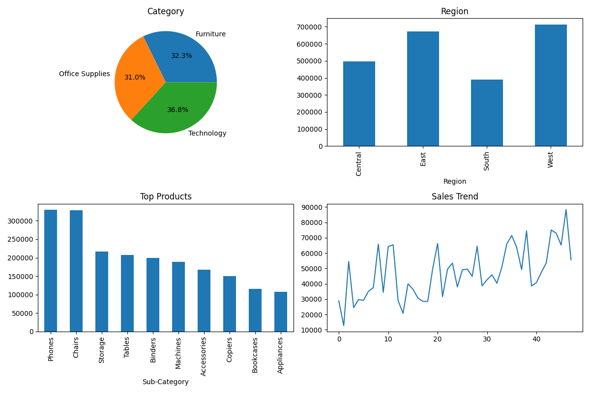

# 📊 Superstore Sales Analysis Dashboard (SQL + Python)

An end-to-end data analytics project where sales data is cleaned using SQL and analyzed using Python to generate actionable business insights.

---

## 🎯 Objective
The goal of this project is to analyze sales performance and provide data-driven recommendations to improve business profitability and decision-making.

---

## 🔧 Tools Used
- MySQL (Data Cleaning)
- Python (Pandas, Matplotlib, Seaborn)

---

## 🔄 Project Workflow
1. Data Cleaning using MySQL  
2. Data Extraction into Python  
3. Data Analysis using Pandas  
4. Visualization using Matplotlib & Seaborn  
5. Business Insights & Recommendations  

---

## 📊 Key Metrics
- Total Sales  
- Total Profit  
- Total Orders  
- Profit Margin  

---

## 📸 Dashboard Preview

---

## 📊 Business Insights

- The West region generates the highest sales, indicating strong regional performance.  
- Technology category is the primary revenue driver.  
- Presence of loss-making products indicates inefficiencies in pricing or cost structure.  
- High discounts are significantly impacting profitability.  
- Sales show a steady upward trend, indicating business growth.  

---

## 💡 Recommendations

- Focus marketing and inventory in high-performing regions like the West.  
- Promote high-revenue categories such as Technology.  
- Identify and reduce loss-making products.  
- Optimize discount strategy to protect profit.  
- Continue strategies that drive sales growth.  

---

## 📈 Output
- Dashboard (dashboard.png)
- Charts generated using Python

---

## 🚀 Future Improvements
- Build interactive dashboard using Streamlit  
- Add forecasting models  
- Deploy as a web application  
